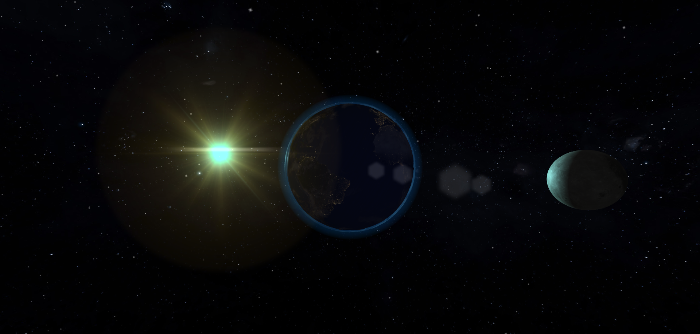

# A glimpse over the stars

Small Threejs project strongly inspired by several others existing on the web.  
I wanted to stand out proposing the moon orbiting around the Earth. (Not real orbit, it's just to be nice to see)  

[Live Demo Here (Issues on mobile)](https://tolexia.github.io/threejs-astronomy/dist/index.html)

## Preview

